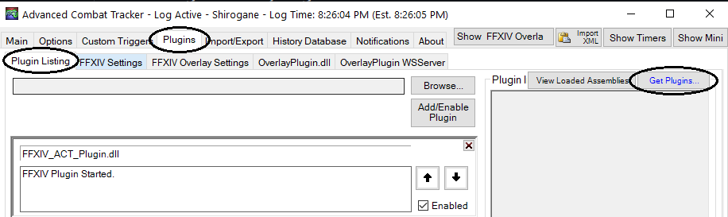
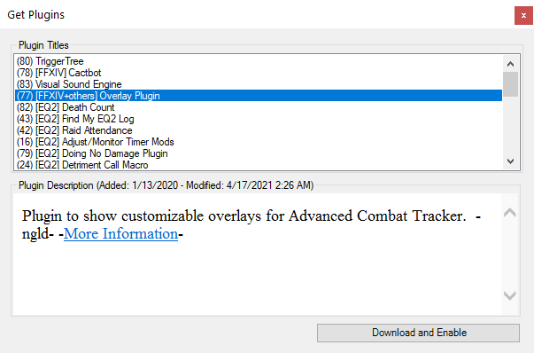
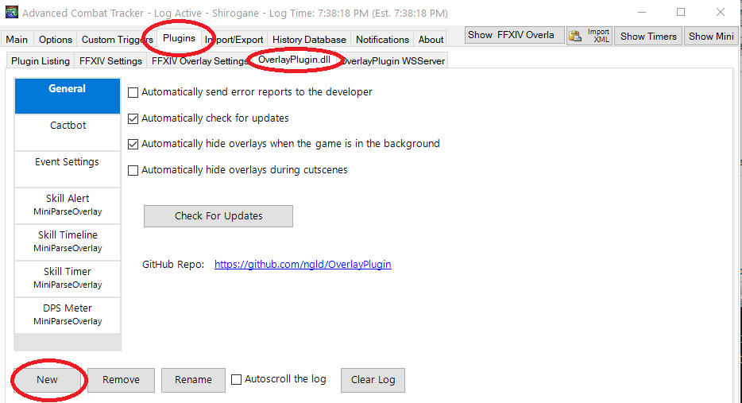
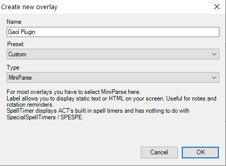
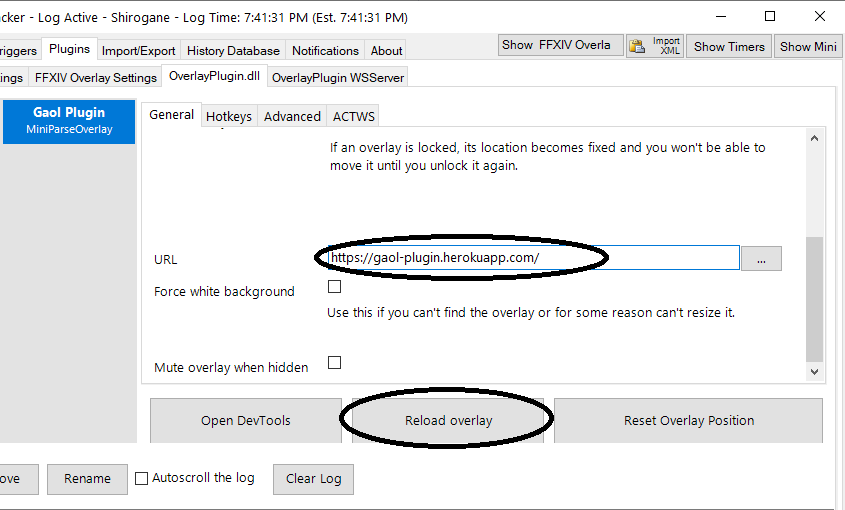

# Getting Started with Gaol Plugin

This project was bootstrapped with suffering in UwU.

## Available Scripts

## Installing

### Dependencies

Install the 64-bit version of [Advanced Combat Tracker](http://advancedcombattracker.com/), if you have not already.

### Install ngld OverlayPlugin

If you select the `Plugins` tab and go to the `Plugin Listing`,
your list of plugins should look something like this:

Click on `Get Plugins` to open up the ACT plugin installer.

Select `Overlay Plugin` and then click `Download and Enable`.

This will download the ngld OverlayPlugin into
`%APPDATA%Advanced Combat Tracker\Plugins\OverlayPlugin`
and enable `OverlayPlugin.dll` in the list of plugins.

As a note, you must use the [ngld](https://github.com/ngld) version of
OverlayPlugin and not the original RainbowMage version or the hibiyasleep fork.

### Install FFXIV Gaol Overlay

At this point, if you have just installed ACT and OverlayPlugin,
then you will be presented with a custom overlay.
To get to the custom overlay otherwise,
click on `Plugins` tab and go to `OverlayPlugin.dll` and then click on `New`.

In create new overlay,
Enter `Name`, Select preset `Custom`, type `Miniparse` and than click on `OK`.
This will create a new overlay and click to it in the list of overlays.

In the overlay setting,
Enter the URL and then click on `Reload Overlay`.

Coming soon
