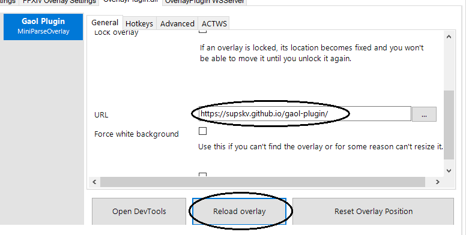
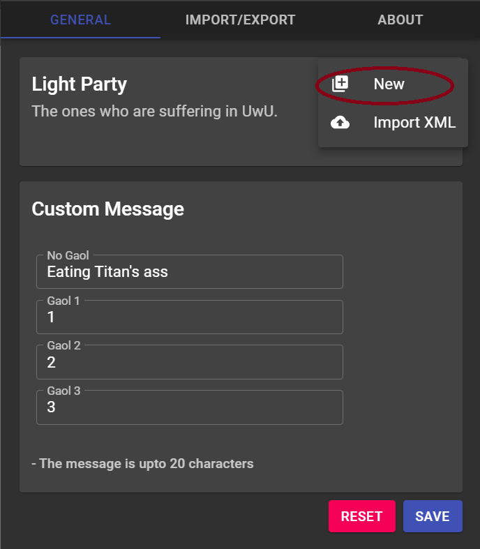
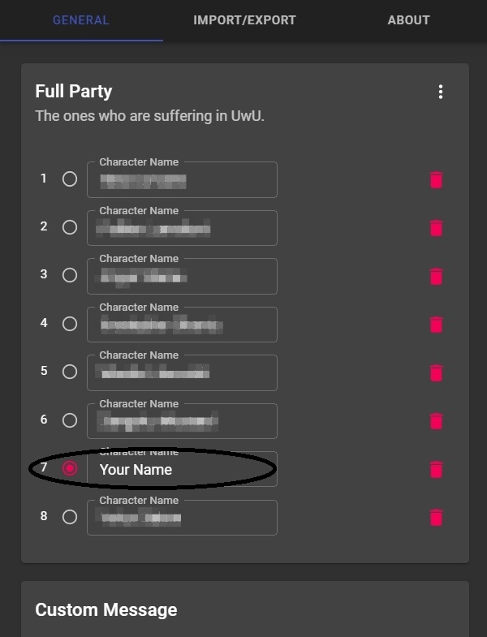
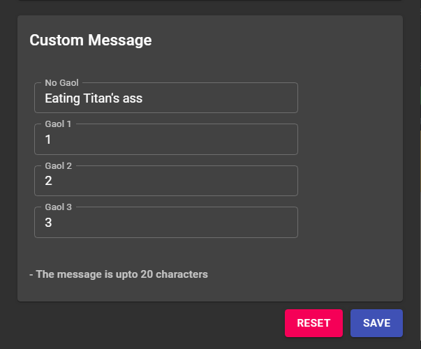
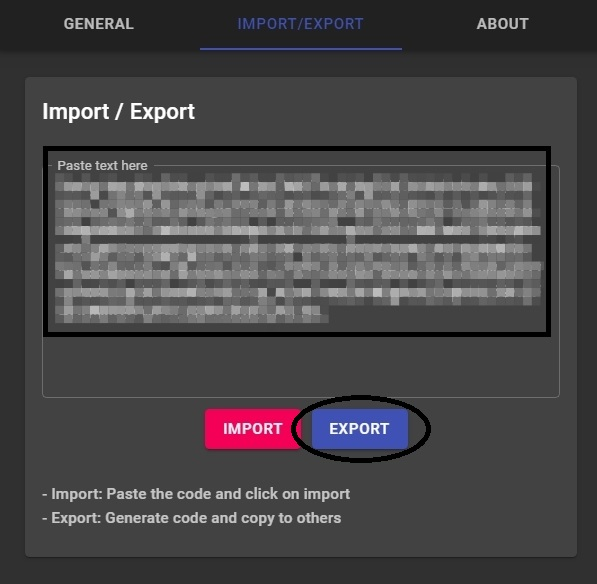
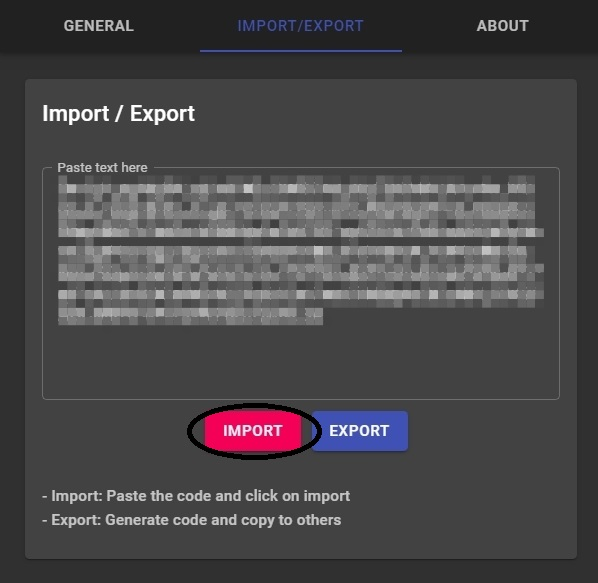

# gaol ontip (ffxiv uwu overlay)

This project was bootstrapped with suffering in UwU.

## Installing

### Dependencies

Install the 64-bit version of [Advanced Combat Tracker](http://advancedcombattracker.com/), if you have not already.

### Install ngld OverlayPlugin

If you select the `Plugins` tab and go to the `Plugin Listing`,
your list of plugins should look something like this:

Click on `Get Plugins` to open up the ACT plugin installer.

Select `Overlay Plugin` and then click `Download and Enable`.

This will download the ngld OverlayPlugin into
`%APPDATA%Advanced Combat Tracker\Plugins\OverlayPlugin`
and enable `OverlayPlugin.dll` in the list of plugins.

As a note, you must use the [ngld](https://github.com/ngld) version of
OverlayPlugin and not the original RainbowMage version or the hibiyasleep fork.

### Install FFXIV Gaol Overlay

At this point, if you have just installed ACT and OverlayPlugin,
then you will be presented with a custom overlay.
To get to the custom overlay otherwise,
click on `Plugins` tab and go to `OverlayPlugin.dll` and then click on `New`.

In create new overlay,
Enter `Name`, Select preset `Custom`, type `Miniparse` and than click on `OK`.
This will create a new overlay and click to it in the list of overlays.

In the overlay setting, Enter the `https://supskv.github.io/gaol-plugin`.

Finally, click on `Reload Overlay` or restart ACT.

## How to use it

** IMPORTANT: THE PARTY MUST BE ARRANGED IN THE SAME ORDER WITH OTHER **\
The feature to help in exporting/importing [here](#how-to-importexport-the-party)

Firstly, click on `Setting` to open setting window,
click `New` button in `More` icon on the top-right corner to add new member.

Secondly, Select your position (mark red radio on front of the name).

(Optional) Adding custom TTS message in custom panel.

Finally, click `Save` on the end of window.

## How to import/export the party

### Export
After added the full party, go to `Import/Export` tab, then click on `Export` button

Copy the generated code and share with others

### Import

Go to `Import/Export` tab, paste the generated code then click `Import`

Select your position (mark red radio on front of the name) in `General` tab.\
Finally, click on `Save` button.

## How to test it
Put these lines in a macro and change the names below to members within the party. then run the macro.

`/e #-135-YOUR NAME`\
`/e #-135-Alishba Holt`\
`/e #-135-Tobey Fitzgerald`

Have fun!
